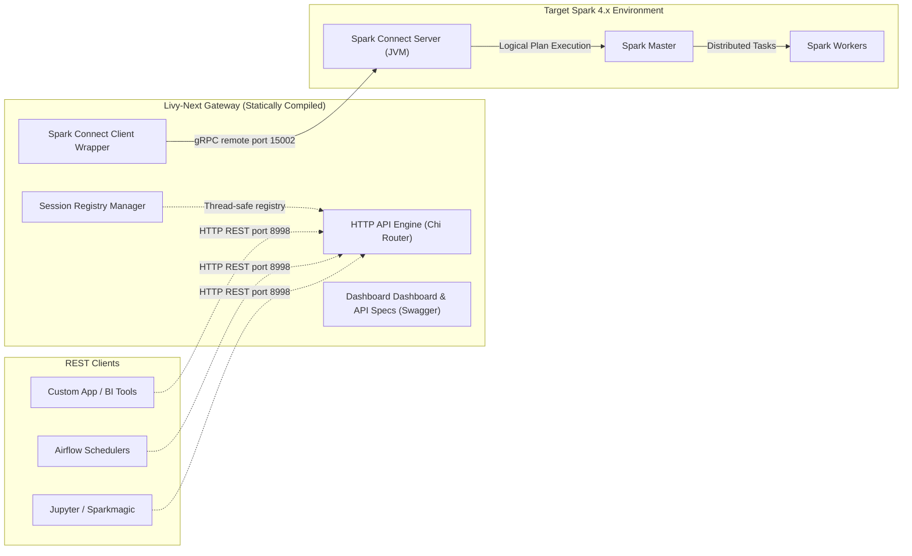
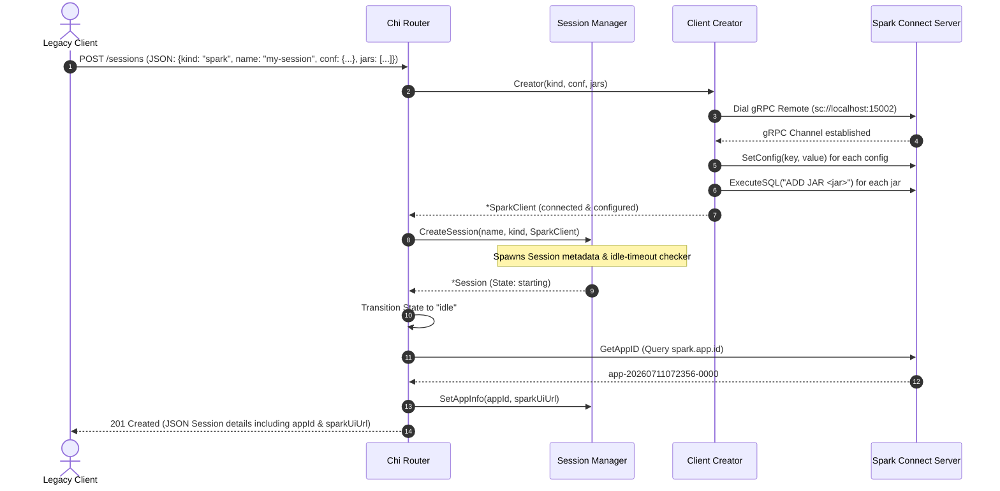
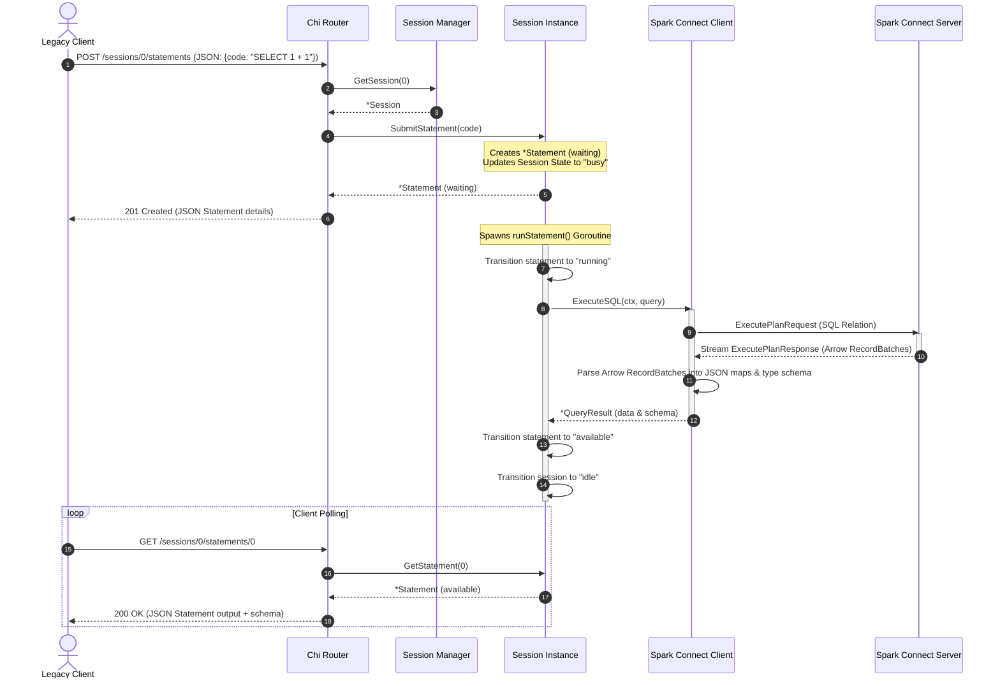

# High-Level Design (HLD)

This document describes the high-level system architecture, network boundaries, topology, and execution flows for **`livy-next`**.

---

## 1. System Context & Boundaries

`livy-next` is a stateless translation gateway. It is designed to expose the traditional Apache Livy REST API while communicating with modern Spark 4.x clusters via the gRPC-based Spark Connect protocol.

---

## 2. request/response Sequence Diagrams

### 2.1 Interactive Session Creation (`POST /sessions`)

When a client requests a new session, the gateway validates the session type, initializes a remote Spark Connect gRPC connection channel, and adds the session metadata to its thread-safe registry.

---

### 2.2 Asynchronous Statement Submission & Polling

Livy uses an asynchronous statement execution model. `livy-next` handles this by immediately returning a `waiting` state, executing the SQL query on a background Go routine, and holding the result in memory for client polling.

