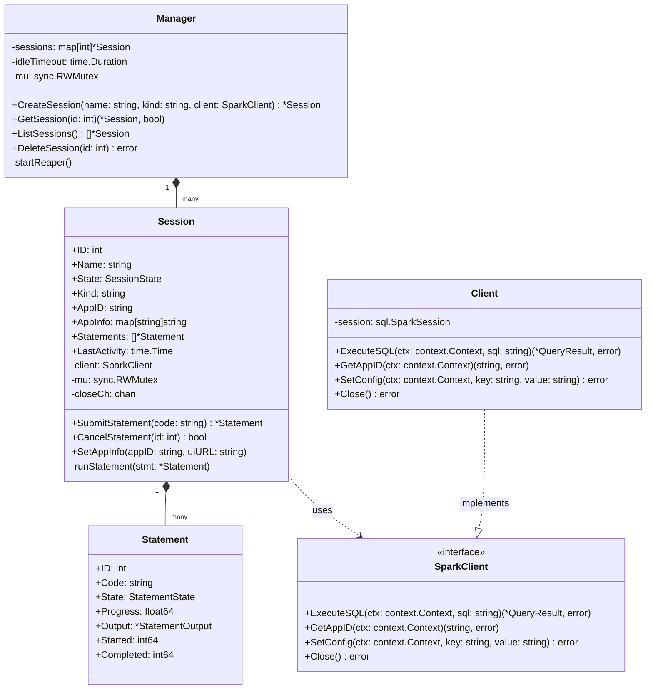
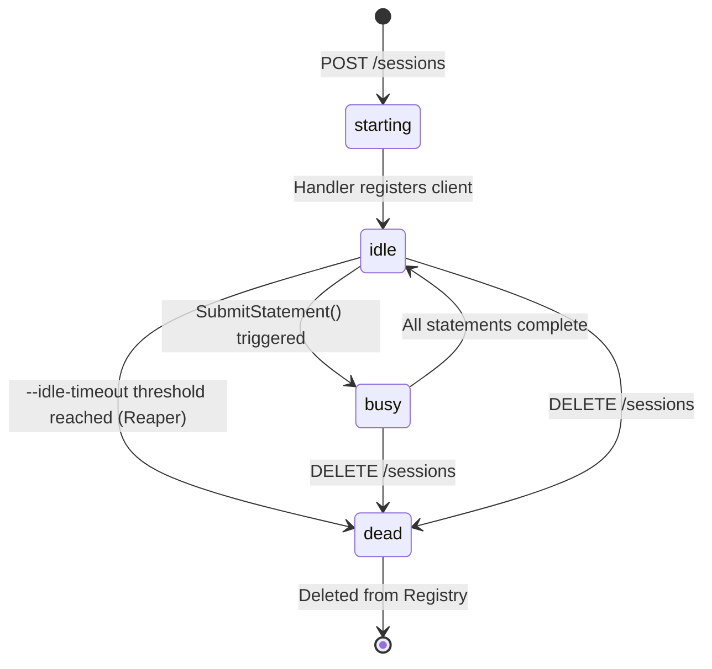
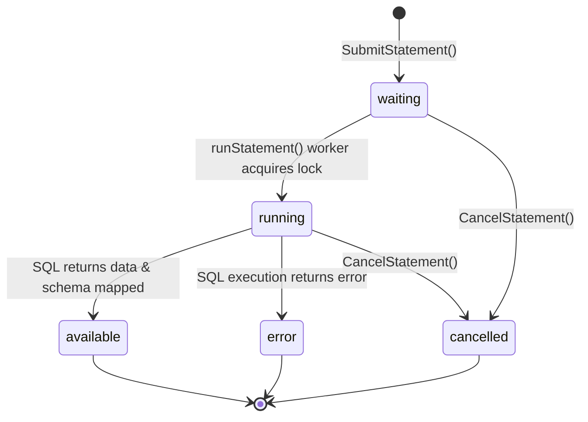

# Low-Level Design (LLD)

This document describes the low-level component classes, internal structs, state transition rules, and package-level details for **`livy-next`**.

---

## 1. Code Modules & Struct Layout

`livy-next` is composed of three internal Go packages: `api`, `session`, and `spark`.

---

## 2. State Machine Transition Logic

### 2.1 Session States

A session lifecycle follows the transitions managed by user actions and automated timeout collectors.

### 2.2 Statement States

Individual code blocks follow a linear sequence, transitioning on goroutine status or cancellation.

---

## 3. Concurrency & Mutex Safety Patterns

To prevent race conditions, the registry and sessions utilize granular Read/Write Mutexes (`sync.RWMutex`):

1. **Registry Operations**: `session.Manager` locks its internal sessions map with `mu.Lock()` during creation or termination, and utilizes `mu.RLock()` for retrievals and lists.
2. **Session Properties**: Access to state, logs, and statements list is protected by a local `sync.RWMutex` inside each `Session` instance.
3. **Background Statement Worker**: The background thread executing `client.ExecuteSQL` does not hold the session lock during network operations, allowing the REST handlers to query status or request cancellation concurrently.

---

## 4. Spark Connect Type Translation

Spark Connect streams record batches using the Apache Arrow IPC layout. The `spark.Client` maps Arrow column structures into Livy JSON definitions:

| Spark Type Class | Arrow/Go Type | Livy Schema Type |
| :--- | :--- | :--- |
| `IntegerType`, `LongType` | `int32`, `int64` | `"integer"` |
| `DoubleType`, `FloatType` | `float32`, `float64` | `"double"` |
| `BooleanType` | `bool` | `"boolean"` |
| `StringType` | `string` | `"string"` |
| Other Types | Unsupported (Default Fallback) | `"string"` |
