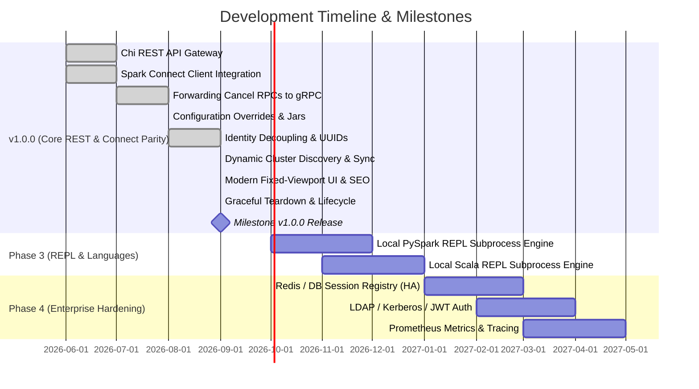

# Project Roadmap

This document outlines the development phases, milestones, and future roadmap for **`livy-next`**.

---

## Roadmap Overview

---

## Detailed Phases

### Phase 1: Core API & Spark Connect Integration (Completed in v1.0.0)
- [x] Lightweight HTTP gateway in Go using `go-chi`.
- [x] Initial Spark Connect gRPC connection capabilities with Apache Arrow translation.
- [x] Asynchronous statement running logic utilizing Go routines and channels.
- [x] Thread-safe interactive session registry with idle timeout garbage collection.
- [x] Type translation formatting matching legacy Apache Livy JSON schemas.
- [x] Embedding Web UI console dashboard and Swagger documentation router.
- [x] Configurable CORS origin headers.

---

### Phase 2: Spark Connect Parity & Reliability (Completed in v1.0.0)
- [x] **Active Cancel Forwarding**: Forward statement cancellations directly via context cancellation to terminate active execution on remote Spark Connect server.
- [x] **Dynamic Configuration Overrides**: Support passing specific cluster configs and custom jar packages in `POST /sessions`, applying configurations dynamically.
- [x] **Proxy-User / Multi-tenant Identity Isolation**: Full decoupling of `user_id`, `session_id` (UUID), `user_agent`, and authentication tokens (`token`), mapping directly to Spark Connect remote connection specifications.
- [x] **Result Pagination & Persistence**: Support standard Livy `from` and `size` parameters on statements, preserving query outputs across multiple reads and preventing premature data purging.
- [x] **Dedicated Spark Connect UI Deep-linking**: Live links in session metadata and web dashboard to `/connect/session/?id=<sessionId>`.
- [x] **Dynamic Spark 4.x Runtime Probing**: Asynchronous startup and session-level queries discovering exact Spark version (`SELECT version()`) and master URL (`spark.master`).
- [x] **Idle Timeout Synchronization**: Dynamic inheritance and real-time syncing of server-side idle timeouts (`spark.connect.session.timeout`).
- [x] **Dual Session Addressing**: Universal acceptance of both sequential IDs (`0`) and UUIDs (`bcc26fc0-...`) across all HTTP endpoints and Swagger 2.0 specs.
- [x] **Modern Fixed-Viewport Dashboard UI**: 100vh app architecture with independent inner scrolling (SQL editor, live logs, session lists, dataframe results with sticky table headers and client pagination).
- [x] **Graceful Lifecycle Management**: OS signal trapping (`SIGTERM`/`SIGINT`), HTTP draining, and atomic `ReleaseSession` RPC teardown.

---

### Phase 3: Language REPL Execution Support (Medium-term)
Spark Connect handles DataFrame plan execution but does not natively interpret raw python/scala code blocks. To support classic Livy notebook workflows (`kind: pyspark` and `kind: spark` containing Scala):
- **Local REPL Execution Engine**: Spin up local Python/Scala subprocess interpreters inside the `livy-next` container.
- **Spark Connect Injector**: Inject pre-configured `spark` SparkSession instances into the local python/scala execution contexts that point back to the Spark Connect remote server.
- **Standard Stream Capturer**: Capture stdout/stderr streams from the local subprocess, translating them back to standard Livy JSON output structures (`"text/plain"`).

---

### Phase 4: Enterprise Production Hardening (Long-term)
- **Stateless Gateway (High Availability)**: Move session registry metadata out of in-memory maps and into distributed stores like Redis or PostgreSQL. This allows scaling the `livy-next` HTTP gateway horizontally behind a load balancer.
- **Enterprise Security**:
  - Integrate token-based JWT authentication, Kerberos authentication delegation, or LDAP directory authentication.
  - Implement secure SSL/TLS communication configurations on REST routes and gRPC channels.
- **Observability**:
  - Add standard Prometheus metrics endpoints tracking active session counts, execution latency, error rates, and remote Spark gRPC query performance.
  - Integrate OpenTelemetry for structured trace propagation.
